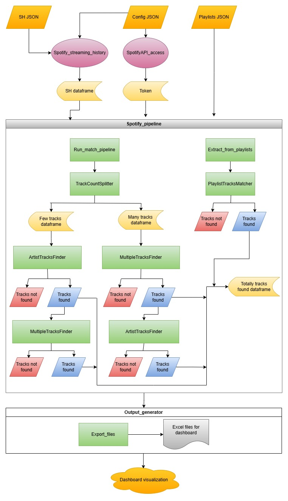

# 🎧 My Spotify Journey
Thank you for your interest in my project. This time I decided to emulate the famous annual Spotify Wrapped, adding additional layers of information to make an in-depth analysis of my streaming history and create a customized dashboard of my musical preferences, with the advantage of using data from anytime of the year.

## 🌐 Overview
The streaming history file given by Spotify was used as the data source. However, since this file contains the trackname, artistname, and the endtime of each play, I decided to create and **end-to-end** Python data extraction pipeline using the **Spotify Web API**, in order to get some useful information to complement the streaming history dataset.

##  📊 Dashboard
See the links below to visualize my dashboard
  - 🔗 Visualize on [NovyPro](https://project.novypro.com/KmFKle)
  - 🔗 Visualize on [Tableau public](https://public.tableau.com/views/Myspotifyjourney/MySpotifyJourney12?:language=es-ES&:sid=&:redirect=auth&:display_count=n&:origin=viz_share_link)

## ⚙️ Pipeline architecture
The following diagram illustrates the complete data extraction workflow of the project, from the raw Spotify data to the final dashboard dataset.

## 🗂️ Project structure

### 🚀 Main
Is the entry point of the project. It orchestrates the complete data extraction workflow, from loading the streaming history to exporting the enriched datasets.

### 📁 Input_files folder
Three files are required: 

- `Config.json`
- `Playlist1.json`
- `StreamingHistory_music_0.json`

The first one contains the credentials of the project. See **Create a Spotify developer app** to know how to get both values `client_id` and `client_secret`.
Update your time zone using the link placed in **references**.

The last two files come from the data Spotify provides when you request your streaming history (see **Get your own Spotify data**).

### 📁 Scripts folder
This folder acts as a Python module and contains the following scripts:

#### 🔐 SpotifyAPI_access
Includes the function `get_token` which generates an access token using both `client_id` and `client_secret` stored in the `config.json` file.

#### 🧹 Spotify_streaming_history
Cleans the streaming history and updates the playback datetime according to the timezone defined in the `config.json` file.

#### 🧰 Spotify_utilities
Includes a set of clases used to obtain information about a track, album or an artist.

Use:
- `GetTrack`
- `GetAlbum`
- `GetArtist`

if you already have the corresponding id.

Otherwise, use:
- `SearchSampleArtistTracks`
- `SearchTracks`

if you want to make the search using the artist name or the track name, respectively.

#### ⚡Spotify_methods
This script defines the methods responsible for processing and handling results obtained from the Spotify API, such as:
- Searching tracks
- Converting API results to dataframe
- Matching the tracks to search with the API results
- Handling search results

#### 🧠 Spotify_missing_data_extraction
This section defines the different strategies used to extract complementary data from the streaming history.

Classes included:

  - **PlaylistTracksMatcher**
    
    Matches tracks that already exist in the user's playlists against tracks in the streaming history.

  - **TrackCountSplitter**
    
    Counts the number of tracks per artist streaming history and classifies as:
    - "**many**" → more than 5 tracks
    - "**few**" → 5 or fewer tracks

  - **ArtistTracksFinder**
    
    Matches streaming history tracks against the most most popular tracks of each artist, obtained using the classes defined in `Spotify_utilities`.

  - **MultipleTracksFinder**

    Searches every track individually using the clases defined in `Spotify_utilites` and then matches them against the API call results.

#### 🔄 Spotify_processing
This is where the main data processing workflow of the project is defined.
  - `Spotify_pipeline` orchestrates the process of matching tracks from a Spotify streaming history with Spotify API data
  - `OutputGenerator` enriches the dataset with useful information about tracks, albums, artists and then export the results as excel files

### 📥 Get your own Spotify data
1. In **references** you will find a link to request your streaming history data. You will be able to download your data within five days.
2. Once you have downloaded your data, you will receive a zip file called:
   `my_spotify_data`.
   Unzip this file and you will find a folder called:
   `Spotify Account Data`
   Copy these two files and paste it into the `Input_files` folder:
   - `StreamingHistory_music_0.json`
   - `Playlist1.json`

### 🧑‍💻 Create a Spotify developer app 
In order to use the Spotify Web API, you must create an app.
1. Go to **References**, you will find a link where you can log in.
2. Click on your username → select **dashboard** → create an app.
3. In the section:
   `Which API/SDKs are you planning to use?`
   select **Web API**.
4. For the **Redirect URIs** I recommend using this: http//127.0.0.1:8000/callback

### ▶️ How to use
Once our app is create: 
1. Go to **settings**
2. Copy the `Client ID` and the `Client secret` values
3. Open the `config.json` file and add the credentials there

Then execute:

`Main_python.py`

This is going to create a new folder called:

`Output_files` 

This folder will contains the additional information about tracks, albums and artists of your streaming history.

⚠️ **Note**

**Main script may take a considerable amount of time to run. Please avoid interrupting the execution.**

## 📦 Install
`pip install -r requirements.txt`

## 🔗 References
  - [Request your data](https://www.spotify.com/us/account/privacy/)
    
  - [Spotify for developers](https://developer.spotify.com/)

  - [Time zones](https://en.wikipedia.org/wiki/List_of_tz_database_time_zones)
